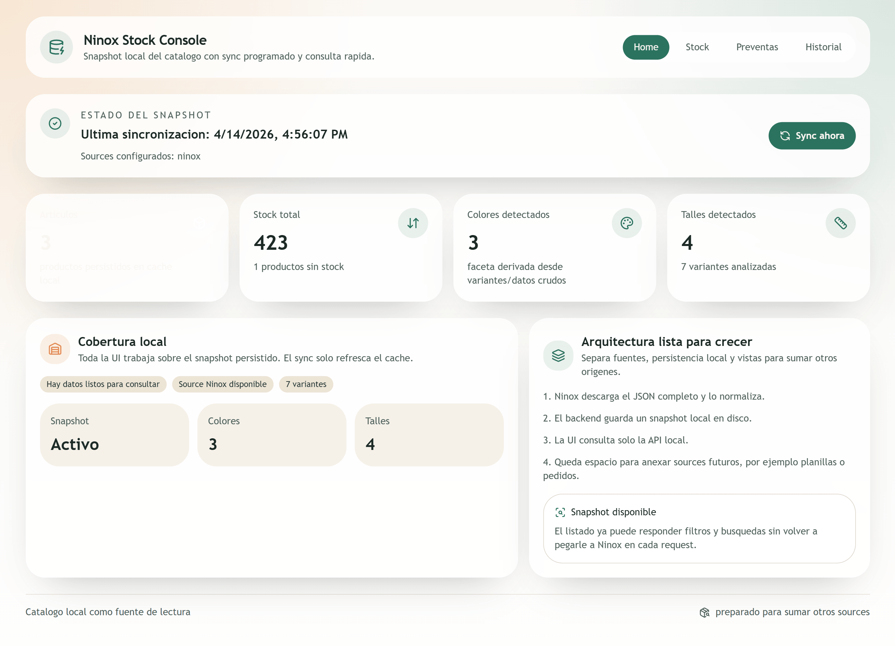
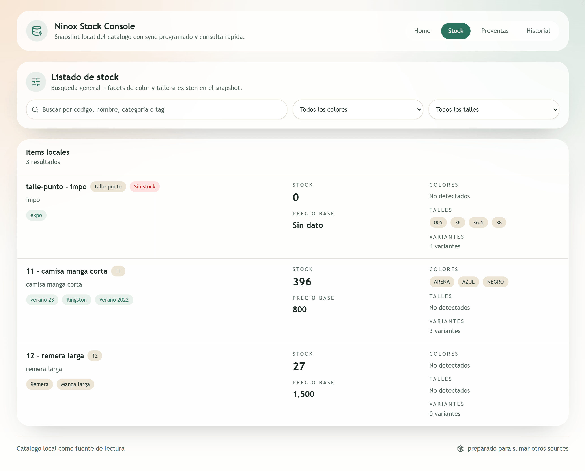
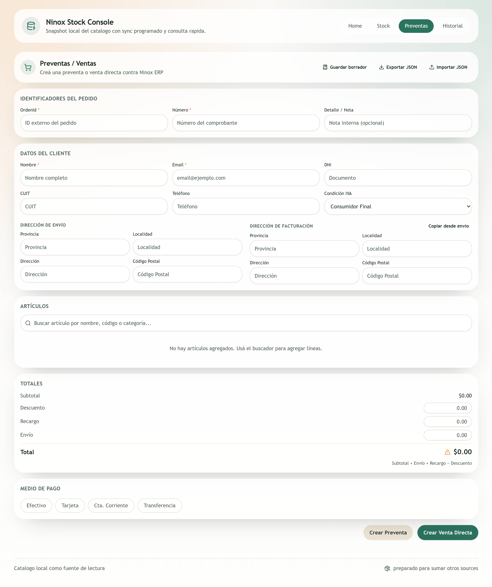

<div align="center">

# Ninox Integration Starters

**Templates y ejemplos listos para integrar sistemas externos con Ninox ERP**

[](https://nodejs.org)
[](https://www.typescriptlang.org)
[](https://react.dev)
[](https://vitejs.dev)
[](https://expressjs.com)

</div>

---



---

## ¿Qué es esto?

Un kit de arranque para conectar cualquier app externa a la **integración de terceros de Ninox**. Incluye un cliente TypeScript reutilizable y una app full-stack de referencia lista para correr.

## Highlights

- **Cliente HTTP listo** — `NinoxClient` en TypeScript con fetch nativo, zero deps extras
- **Normalización tolerante** — mapea la respuesta de Ninox a un modelo local limpio, sin acoplarse a nombres exactos
- **Caché local con sync** — snapshot del catálogo en disco, refresco ≥ 10 min según restricciones de la API
- **Dashboard operativo completo** — React 19 + Vite + Tailwind + Express con rutas de Stock, Preventas e Historial
- **Chatbot con stock visible** — ejemplo Ollama con base de conocimiento, contexto de stock y vista filtrable del catálogo cacheado
- **UI compartida de stock** — paquete React reutilizable para mostrar el mismo stock en dashboard y chatbot
- **Flujo de preventa** — creación de pedidos contra Ninox ERP con validación de totales y métodos de pago
- **Monorepo workspace** — un solo `npm install` levanta template + app
- **Mocks offline** — `shared/sample-responses/` para desarrollar sin token

## Stack

| Capa | Tecnología |
|------|-----------|
| Frontend | React 19, React Router 7, TailwindCSS, Lucide React |
| Backend | Express 4, TypeScript 5 |
| Build | Vite 7, TSC, SWC |
| Dev | concurrently, tsx |
| Runtime | Node.js 18+, fetch nativo |

## Quick start

```bash
# 1. Instalar dependencias del monorepo
npm install

# 2. Configurar variables de entorno
cp examples/stock-dashboard-app/.env.example examples/stock-dashboard-app/.env
```

```env
NINOX_BASE_URL=https://api.test-ninox.com.ar
NINOX_TOKEN=tu_token
```

```bash
# 3. Levantar backend + frontend
npm run dev
```

Abre `http://localhost:5173` — el dashboard sincroniza el catálogo automáticamente.

```bash
# O compilar para producción
npm run build && npm start
```

---

## Screenshots

### Stock — búsqueda y filtros por color y talle



### Preventas / Ventas — creación de pedidos contra Ninox ERP



---

## Qué incluye

| Path | Descripción |
|------|-------------|
| `templates/node-typescript` | Cliente base: `NinoxClient`, normalización, tipos TypeScript |
| `packages/stock-ui` | Componentes React compartidos para listado/filtros de stock |
| `examples/stock-dashboard-app` | App full-stack React + Express — dashboard operativo completo |
| `examples/chatbot-ollama-app` | Chatbot full-stack con Ollama, base de conocimiento y stock cacheado visible |
| `examples/chatbot-stock` | Búsqueda de productos por texto para bots o asistentes |
| `examples/ecommerce-sync` | Mapeo del catálogo a una estructura simple para storefronts |
| `examples/create-order` | Placeholder del flujo de envío de pedidos |
| `shared/sample-responses` | Respuestas de muestra para desarrollo offline |
| `shared/postman` | Colección y entorno de Postman |

### Ejemplos desde el template

```bash
cd templates/node-typescript
node ../../examples/chatbot-stock/run.js remera negra
node ../../examples/ecommerce-sync/run.js
node ../../examples/create-order/run.js
```

---

## Arquitectura del dashboard

```
┌─────────────────────────────────────────────────────┐
│                    React + Vite                      │
│         (Stock · Preventas · Historial)              │
└───────────────────────┬─────────────────────────────┘
                        │ fetch /api
┌───────────────────────▼─────────────────────────────┐
│                  Express server                      │
│  catalog-sync-service   →   snapshot en disco (JSON) │
│  catalog-query-service  →   búsqueda y filtros       │
│  preventa-history-service → historial de pedidos     │
└───────────────────────┬─────────────────────────────┘
                        │ cada ≥ 10 min
┌───────────────────────▼─────────────────────────────┐
│              Ninox API (GetData / Pedido)             │
└─────────────────────────────────────────────────────┘
```

La UI solo habla con el backend local. El token de Ninox nunca sale del servidor.

## UI compartida de stock

`packages/stock-ui` expone `StockCatalogView` y tipos de stock (`ProductsPayload`, `StockRow`) para que distintos ejemplos muestren el mismo catálogo cacheado sin duplicar componentes. Cada app conserva su backend local y sólo debe proveer una función `loadProducts(params)` que devuelva el shape `{ items, total, filters, facets }`.

Actualmente lo usan:

- `examples/stock-dashboard-app/src/routes/stock-page.tsx` contra `/api/products`.
- `examples/chatbot-ollama-app/src/routes/stock-page.tsx` contra `/api/stock/products`.

---

## API de Ninox — referencia rápida

| Método | Endpoint | Descripción |
|--------|----------|-------------|
| `GET` | `/integraciones/Terceros/GetData` | Catálogo agrupado por artículo |
| `GET` | `/integraciones/Terceros/GetDataCurva` | Catálogo plano por variante |
| `POST` | `/integraciones/Terceros/Pedido` | Crear pedido / reserva |
| `POST` | `/integraciones/Terceros/Pedido/cancelar` | Cancelar pedido por `facturaid` |

**Header requerido:** `X-NX-TOKEN: {tu_token}`

| Entorno | Base URL |
|---------|----------|
| Testing | `https://api.test-ninox.com.ar` |
| Producción | `https://api.ninox.com.ar` |

> **Restricción importante:** el catálogo no acepta consultas más frecuentes que cada 10 minutos — responde `403` si se intenta antes.

---

## Documentación

- [Guía de inicio rápido](docs/getting-started.md)
- [Guía de integración técnica](docs/integration-guide.md)
- [Documentación oficial de Ninox](https://docs.ninox.com.ar/docs/integraciones/terceros)
- PDFs con schema de datos y webhooks en `data/`

## ¿No tenés token?

Contactá a [dev@banhaia.com](mailto:dev@banhaia.com) o seguí el proceso en [ninoxnet.com/integraciones/terceros](https://www.ninoxnet.com/integraciones/terceros). Mientras tanto podés desarrollar con los mocks en `shared/sample-responses/`.
