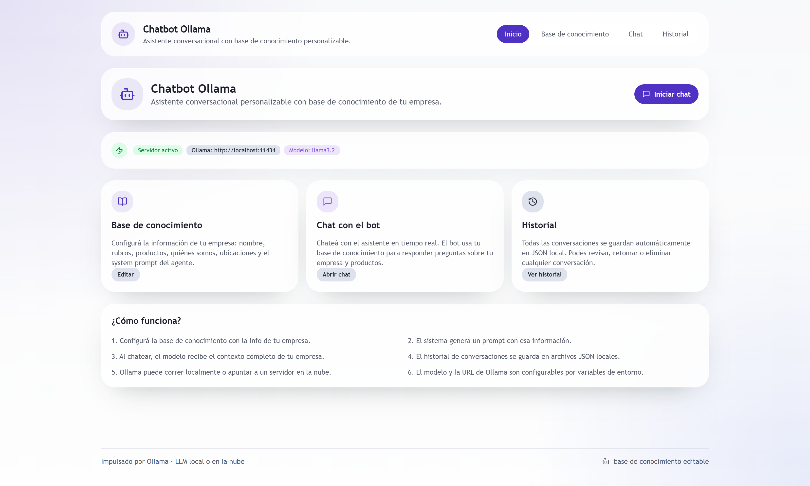
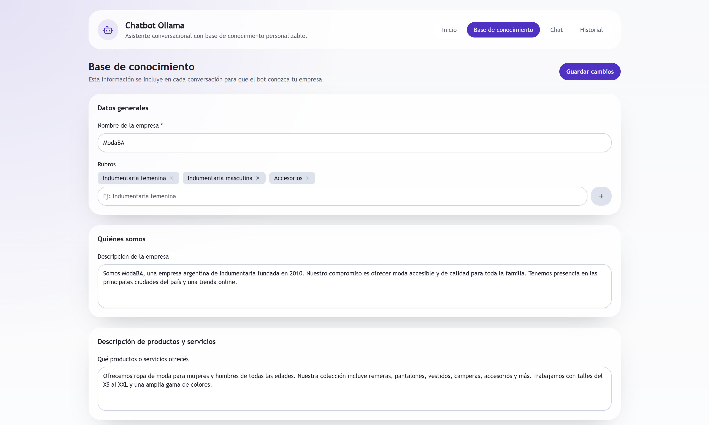
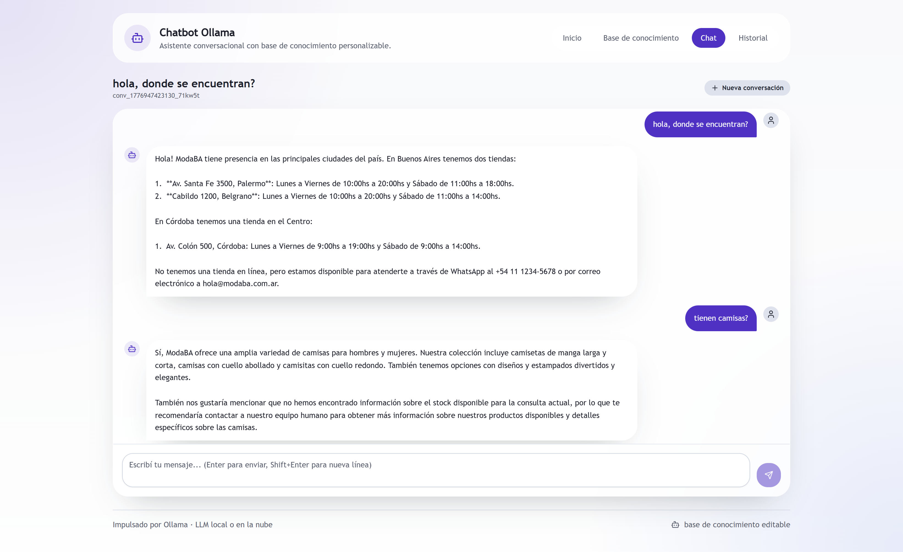
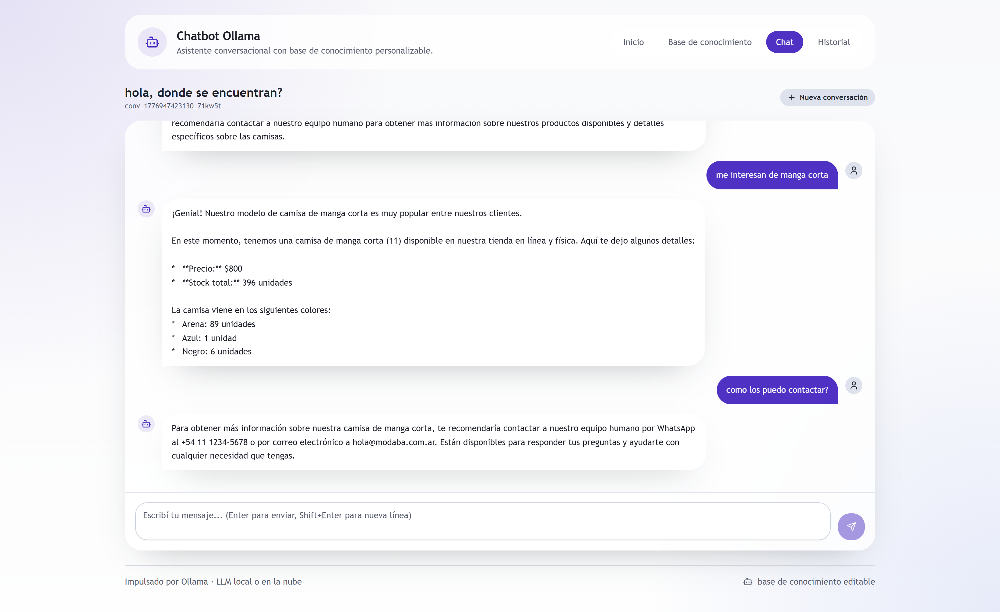
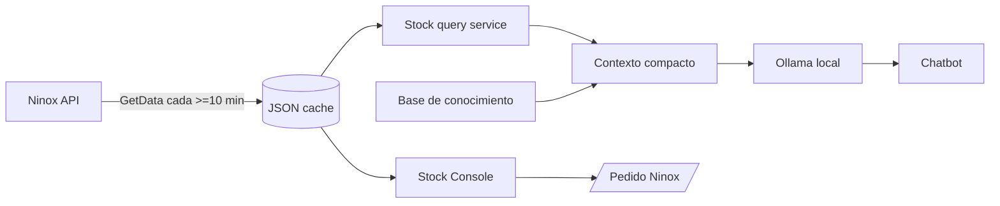

<div align="center">

# Ninox Integration Starters

**Stock, pedidos y chatbot local para integrar apps externas con Ninox ERP**

[](https://nodejs.org)
[](https://www.typescriptlang.org)
[](https://react.dev)
[](https://vitejs.dev)
[](https://expressjs.com)
[](https://ollama.com)

</div>

---



## Qué es esto

Un starter kit para conectar aplicaciones externas con la **integración de terceros de Ninox**. Incluye un cliente TypeScript reutilizable, una consola de stock/pedidos y un chatbot con Ollama que corre localmente y usa el stock cacheado como contexto.

La idea es que puedas clonar el repo, configurar un token Ninox y tener una integración funcional para explorar catálogo, disponibilidad, variantes, preventas y atención conversacional.

## Lo más importante

| Experiencia | Qué resuelve | App |
|-------------|--------------|-----|
| **Stock Console** | Sincroniza catálogo de Ninox, cachea stock local, filtra por búsqueda/color/talle y permite crear preventas o ventas. | `examples/stock-dashboard-app` |
| **Chatbot Ollama** | Corre un asistente local con base de conocimiento editable, historial y contexto de stock real para responder disponibilidad. | `examples/chatbot-ollama-app` |
| **Stock UI compartida** | Reutiliza el mismo listado/filtros de stock en dashboard y chatbot. | `packages/stock-ui` |
| **Template Node + TS** | Cliente `NinoxClient`, normalización de productos y tipos base. | `templates/node-typescript` |

## Features

- **Stock cacheado**: snapshot local en JSON, sync programado y refresh manual.
- **Búsqueda real de catálogo**: productos, variantes, talles, colores, categorías, tags y precios.
- **Chatbot local-first**: Ollama corre en tu máquina o en tu propio servidor; el token de Ninox nunca llega al frontend.
- **Base de conocimiento editable**: empresa, rubros, productos, ubicaciones y system prompt.
- **Contexto de stock para el LLM**: el backend selecciona productos relevantes y evita enviar todo el catálogo.
- **Preventa / venta**: payload validado y envío a `/Pedido` de Ninox.
- **Monorepo moderno**: npm workspaces, React 19, Vite 7, Express, TypeScript strict y Tailwind.
- **Mocks offline**: `shared/sample-responses/` para avanzar sin credenciales.

## Quick Start

```bash
npm install
```

### Opción A: Stock Console

```bash
cp examples/stock-dashboard-app/.env.example examples/stock-dashboard-app/.env
```

```env
NINOX_BASE_URL=https://api.test-ninox.com.ar
NINOX_TOKEN=tu_token
CATALOG_SYNC_INTERVAL_MS=600000
```

```bash
npm run dev
```

Abrí `http://localhost:5173`. El backend queda en `http://localhost:3030`.

### Opción B: Chatbot Ollama local

Instalá Ollama y descargá un modelo. Para empezar, recomendamos **Qwen** o **Llama**:

```bash
# Buena primera opción para notebooks con recursos moderados
ollama pull qwen3:4b

# Alternativa liviana y rápida
ollama pull llama3.2
```

Configurá el chatbot:

```bash
cp examples/chatbot-ollama-app/.env.example examples/chatbot-ollama-app/.env
```

```env
PORT=3031
OLLAMA_BASE_URL=http://localhost:11434
OLLAMA_MODEL=qwen3:4b
NINOX_BASE_URL=https://api.test-ninox.com.ar
NINOX_TOKEN=tu_token
STOCK_CONTEXT_MAX_PRODUCTS=8
```

```bash
npm run dev:chatbot
```

Abrí `http://localhost:5174`. El backend queda en `http://localhost:3031`.

> El chatbot funciona aunque Ninox no esté configurado, pero responderá sin stock actualizado hasta que exista un snapshot local.

## Screenshots

### Chatbot Ollama

| Home | Base de conocimiento |
|------|----------------------|
|  |  |

| Chat con contexto de stock | Conversación |
|----------------------------|--------------|
|  |  |

### Stock Console

| Stock filtrable | Preventas / Ventas |
|-----------------|--------------------|
|  |  |

## Cómo funciona



El frontend siempre habla con un backend local. El token `X-NX-TOKEN` se guarda del lado servidor y no se expone al navegador.

## Qué incluye

| Path | Descripción |
|------|-------------|
| `templates/node-typescript` | Cliente base: `NinoxClient`, normalización, tipos TypeScript |
| `packages/stock-ui` | Componentes React compartidos para listado/filtros de stock |
| `examples/stock-dashboard-app` | App React + Express para stock, preventas, ventas e historial |
| `examples/chatbot-ollama-app` | Chatbot Ollama con knowledge base, stock visible e historial |
| `examples/chatbot-stock` | Script simple de búsqueda por texto |
| `examples/ecommerce-sync` | Mapeo del catálogo a una estructura para storefronts |
| `examples/create-order` | Placeholder de creación de pedidos |
| `shared/sample-responses` | Respuestas de muestra para desarrollo offline |
| `shared/postman` | Colección y entorno de Postman |

## Scripts útiles

```bash
npm run build          # compila template + dashboard + chatbot
npm run dev            # stock dashboard: frontend 5173 + backend 3030
npm run dev:chatbot    # chatbot: frontend 5174 + backend 3031
npm run start          # dashboard compilado
npm run start:chatbot  # chatbot compilado
```

Ejemplos simples:

```bash
node examples/chatbot-stock/run.js "remera negra"
node examples/ecommerce-sync/run.js
node examples/create-order/run.js
```

## API de Ninox

| Método | Endpoint | Descripción |
|--------|----------|-------------|
| `GET` | `/integraciones/Terceros/GetData` | Catálogo agrupado por artículo |
| `GET` | `/integraciones/Terceros/GetDataCurva` | Catálogo plano por variante |
| `POST` | `/integraciones/Terceros/Pedido` | Crear pedido / reserva |
| `POST` | `/integraciones/Terceros/Pedido/cancelar` | Cancelar pedido por `facturaid` |

**Header requerido:** `X-NX-TOKEN: {tu_token}`

| Entorno | Base URL |
|---------|----------|
| Testing | `https://api.test-ninox.com.ar` |
| Producción | `https://api.ninox.com.ar` |

> Restricción importante: el catálogo no acepta consultas más frecuentes que cada 10 minutos. Si se consulta antes, Ninox responde `403 Forbidden`.

## Modelos Ollama recomendados

- `qwen3:4b`: buen punto de partida para chat local en equipos razonables.
- `llama3.2`: alternativa liviana, rápida y simple de probar.
- Si tenés más memoria, podés subir a modelos Qwen o Llama más grandes manteniendo el mismo `OLLAMA_MODEL`.

La app usa la API local de Ollama en `http://localhost:11434` por defecto, pero podés apuntarla a un servidor propio con `OLLAMA_BASE_URL`.

## Documentación

- [Guía de inicio rápido](docs/getting-started.md)
- [Guía de integración técnica](docs/integration-guide.md)
- [Módulo Stock Dashboard](docs/modules/stock-dashboard-app.md)
- [Módulo Chatbot Ollama](docs/modules/chatbot-ollama-app.md)
- [Documentación oficial de Ninox](https://docs.ninox.com.ar/docs/integraciones/terceros)
- PDFs con schema de datos y webhooks en `data/`

## ¿No tenés token?

Contactá a [dev@banhaia.com](mailto:dev@banhaia.com) o seguí el proceso en [ninoxnet.com/integraciones/terceros](https://www.ninoxnet.com/integraciones/terceros). Mientras tanto podés desarrollar con los mocks en `shared/sample-responses/`.
