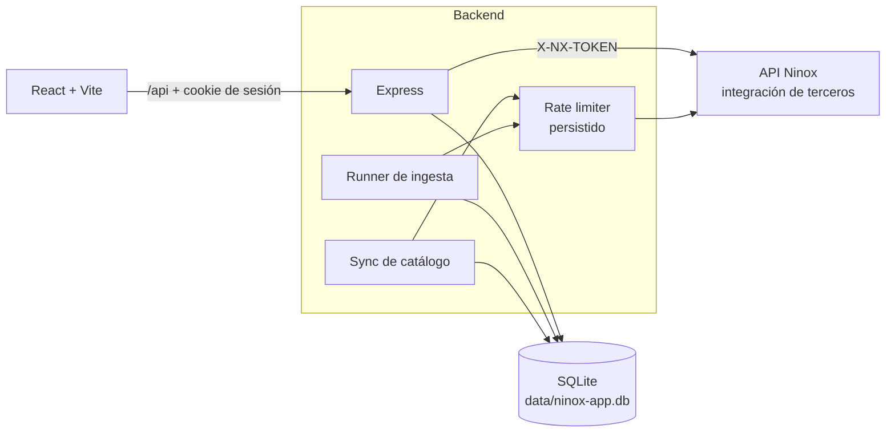

<div align="center">

# Ninox Integration Starter

**Una app integrada a Ninox ERP lista para usar: catálogo, stock, reservas, ventas, ingesta de datos y reportes sobre SQLite.**

[](https://github.com/banhaia/ninox-integration-starters/actions/workflows/ci.yml)
[](https://nodejs.org)
[](https://www.typescriptlang.org)
[](https://react.dev)
[](https://github.com/WiseLibs/better-sqlite3)

</div>

---

## Qué es

Una aplicación de referencia para la [integración de terceros de Ninox](https://docs.ninox.com.ar/docs/terceros). Clonás, instalás, cargás tu token y tenés una app funcionando que ya resuelve lo difícil: rate limits, idempotencia de pedidos, paginación de exportaciones y persistencia local. Desde ahí la extendés para tu caso: ecommerce propio, chatbot con stock, sincronización con un CRM o tableros de gestión.

> ¿Querés una **tienda online**? Usá [ninox-ecommerce-starter](https://github.com/banhaia/ninox-ecommerce-starter).

## Empezá con una IA

No hace falta saber programar. Copiá este mensaje en el asistente de IA que uses (Claude, ChatGPT/Codex, Gemini, Grok, Cursor…), completá lo que está entre corchetes y dejá que te guíe:

```text
Quiero tener mi propia app integrada a Ninox ERP usando este starter:
https://github.com/banhaia/ninox-integration-starters

Tratalo como un repositorio de código: leé su ONBOARDING.md y seguí esas instrucciones.
Ayudame a crear mi propia copia del proyecto, instalá lo que me falte (o explicame
cómo, paso a paso) y dejá la app funcionando.

Sobre mí: [no soy programador / sé algo de programación / soy desarrollador].
Uso [Windows / Mac / Linux / solo el celular]. [Tengo / Todavía no tengo] token de Ninox.

Si desde donde estás no podés ejecutar comandos, decímelo y recomendame la mejor
alternativa, incluso si conviene pasárselo a alguien técnico.
```

La IA se encarga de los detalles técnicos según tu equipo. Nunca le pegues el token en el chat: se carga en la app.

## Inicio rápido (manual)

```bash
git clone https://github.com/banhaia/ninox-integration-starters.git
cd ninox-integration-starters
npm install && npm run dev
```

Abrí http://localhost:5173:

1. **Primer acceso**: creá el usuario administrador (contraseña de 6 caracteres como mínimo).
2. **Configuración**: pegá el token `X-NX-TOKEN`, elegí el entorno (testing o producción) y probá la conexión.
3. **Inicio**: sincronizá el catálogo.
4. **Ingesta**: importá los meses de ventas y compras que quieras analizar.
5. **Reportes**: indicadores mensuales y gráficos.

¿No tenés token? Pedilo en [ninoxnet.com/integraciones/terceros](https://www.ninoxnet.com/integraciones/terceros) o a dev@banhaia.com.

## Módulos

| Módulo | Qué hace | Endpoints de Ninox |
|---|---|---|
| **Acceso** | Login local; la primera vez se crea el usuario (autosetup). | — |
| **Catálogo y stock** | Sincroniza artículos, variantes (talle/color), precios, categorías y stock a SQLite, con búsqueda y filtros. | `GetData` |
| **Reservas y ventas** | Crea reservas (preventas) y ventas directas con `ordenId` idempotente. Permite cancelar, reintentar y consultar el comprobante. | `Pedido`, `Pedido/cancelar`, `venta`, `comprobante/{id}`, `medios-pago` |
| **Ingesta de datos** | Importa ventas y compras con ítems detallados, totales y medios de pago, mes por mes y con progreso por página. Reimportar no duplica. Exporta a CSV. Stock por depósito y saldos quedan preparados. | `exportar/ventaitems`, `ventatotales`, `compraitems`, `compratotales` (paginados) |
| **Reportes** | Módulo interno que lee solo la base local: ventas netas, ticket promedio, unidades, margen estimado, compras, top de artículos y medios de pago. | — |

## Arquitectura


```mermaid
flowchart LR
  UI[React + Vite] -- /api + cookie de sesión --> API[Express]
  API --> DB[(SQLite<br/>data/ninox-app.db)]
  API -- X-NX-TOKEN --> NX[API Ninox<br/>integración de terceros]
  subgraph Backend
    API
    RL[Rate limiter<br/>persistido]
    ING[Runner de ingesta]
    SYNC[Sync de catálogo]
  end
  SYNC --> RL --> NX
  ING --> RL
  ING --> DB
  SYNC --> DB
```

- El token vive solo en el backend (en la base local o en `.env`) y **nunca** llega al navegador.
- Las ventanas de rate limit de Ninox (10 min para el catálogo, 30 s por página de exportación en producción) se guardan en la base: un reinicio no provoca un 403.
- Los reportes nunca llaman a Ninox: trabajan sobre lo ingestado.

## Configuración opcional (.env)

Todo se configura desde la UI. Si preferís variables de entorno, copiá `.env.example` a `.env`. Lo definido ahí tiene prioridad:

| Variable | Default | Uso |
|---|---|---|
| `PORT` | `3030` | Puerto del backend |
| `DATA_DIR` | `./data` | Carpeta de la base SQLite |
| `NINOX_ENV` | `test` | `test`, `prod` o `custom` |
| `NINOX_BASE_URL` | — | URL con `NINOX_ENV=custom` (por ejemplo, una API local) |
| `NINOX_TOKEN` | — | Token de la integración |
| `CATALOG_SYNC_MINUTES` | `15` | Intervalo del sync automático (mínimo 10) |

## Producción

```bash
npm run build
NODE_ENV=production npm start   # sirve frontend y API en :3030
```

> El autosetup queda abierto hasta que se crea el primer usuario: crealo **antes** de exponer la app. Con `NODE_ENV=production` la cookie de sesión exige HTTPS.

## Desarrollo

```bash
npm run validate    # typecheck + tests + build + chequeo de archivos sensibles
npm test            # Vitest: SQLite en memoria y API de Ninox simulada
```

- Guía paso a paso: [docs/getting-started.md](docs/getting-started.md)
- Referencia de la API y decisiones técnicas: [docs/integration-guide.md](docs/integration-guide.md)
- Documentación por módulo: [docs/INDEX.md](docs/INDEX.md)
- Para agentes AI: [ONBOARDING.md](ONBOARDING.md) (primeros pasos guiados), [CLAUDE.md](CLAUDE.md) y [AGENTS.md](AGENTS.md)

### Agente experto en Ninox

El repo trae un agente especialista en la API de terceros: [`.claude/agents/ninox-integration-expert.md`](.claude/agents/ninox-integration-expert.md). Consulta la documentación oficial vigente, conoce la arquitectura de la app y sabe probar contra la API real sin exponer tu token.

1. Poné tu token en `.env` (`NINOX_TOKEN`, `NINOX_ENV=test`). Nunca lo pegues en el chat.
2. En Claude Code: *"Usá el agente ninox-integration-expert para …"* (por ejemplo, "habilitar la ingesta de saldos de clientes" o "agregar un receptor de webhooks de artículos").
3. Con otras herramientas (Codex, Cursor), `AGENTS.md` les indica seguir el mismo playbook.

Para inspeccionar la forma real de una respuesta: `node examples/scripts/probe.mjs "/integraciones/terceros/config" --shape`.

## Ejemplos adicionales

- [`examples/chatbot-ollama-app`](examples/chatbot-ollama-app): chatbot con Ollama que responde con stock real (autocontenido).
- [`examples/scripts`](examples/scripts): scripts de una sola pieza (búsqueda de stock, mapeo a ecommerce, alta de pedido).
- [`shared/postman`](shared/postman): colección Postman con todos los endpoints.

## Seguridad

Este repositorio es público. Nunca commitees tokens, `.env`, la carpeta `data/` ni datos reales de clientes. Las fixtures de `shared/sample-responses/` son ficticias. CI escanea el historial con gitleaks.
